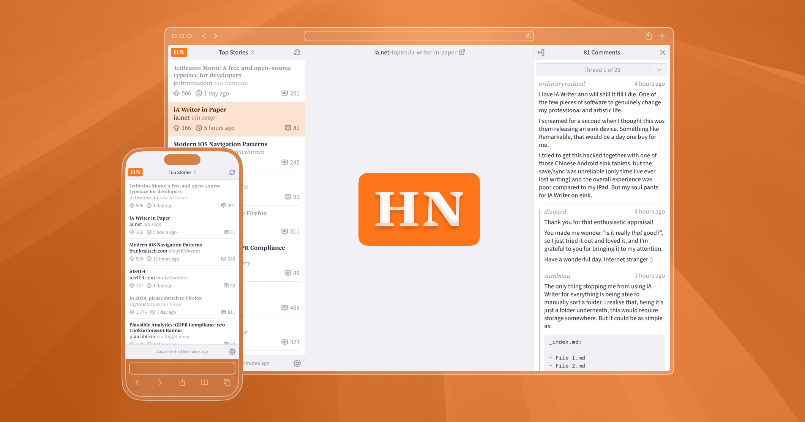

# hackernews.cool

_A multi-column Hacker News reader by @simonlou and @jonamil_



Navigating the original Hacker News website and most third-party web readers means jumping back and forth between the front page, external links and comments pages. [hackernews.cool](https://hackernews.cool/) arranges these as columns of one unified page, making it possible to browse linked websites and discussion threads side-by-side. Additionally, a customizable layout and tweaks to the formatting of comments enhance the reading experience.

### Typefaces

Story titles and usernames are set in [Nice](https://janfromm.de/typefaces/nice/) by Jan Fromm. UI and body text uses [Source Sans](https://github.com/adobe-fonts/source-sans) by Paul D. Hunt.

### Data Sources

Story data is fetched from the [official Hacker News API](https://github.com/HackerNews/API). For comments, the [unofficial API by @cheeaun](https://github.com/cheeaun/node-hnapi) is used, enabling significantly improved loading times compared to the official API.

### Limitations

As a purely client-side application, [hackernews.cool](https://hackernews.cool/) relies on `<object>` tags to embed linked websites within the page. Websites that [deny being embedded](https://developer.mozilla.org/en-US/docs/Web/HTTP/Reference/Headers/X-Frame-Options#deny) (such as GitHub and most news outlets) therefore cannot be displayed. In those cases, a button is provided to open the link in an external tab instead.

## Local Development

### Install Dependencies

```sh
pnpm install
```

### Start Development Server

```sh
pnpm run dev
```

### Create Production Build

```sh
pnpm run build
```
